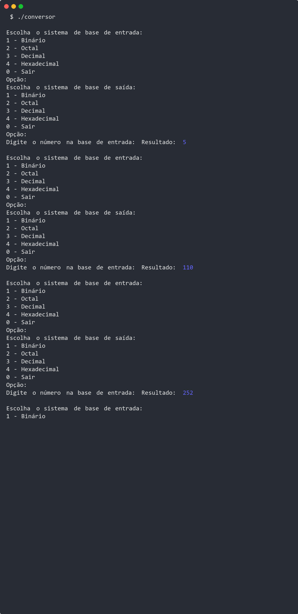
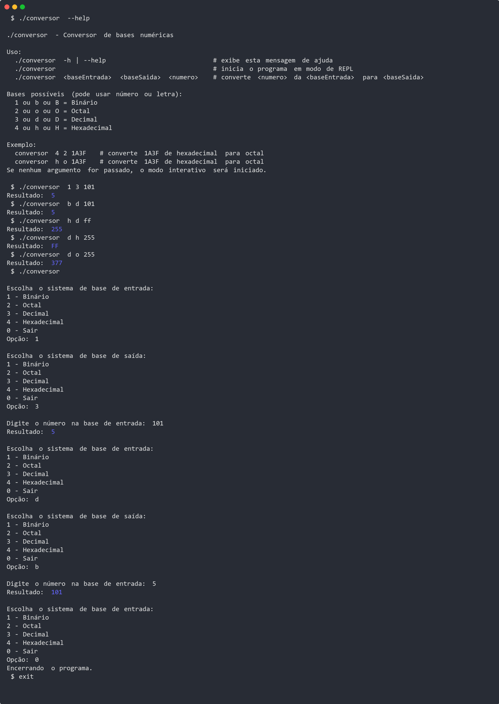
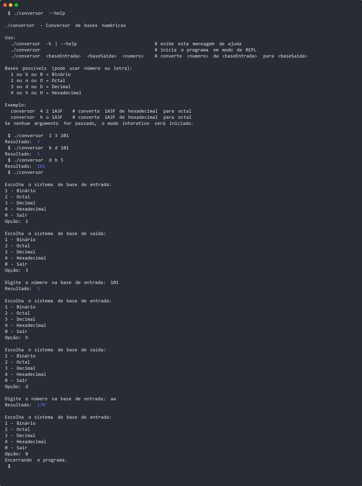
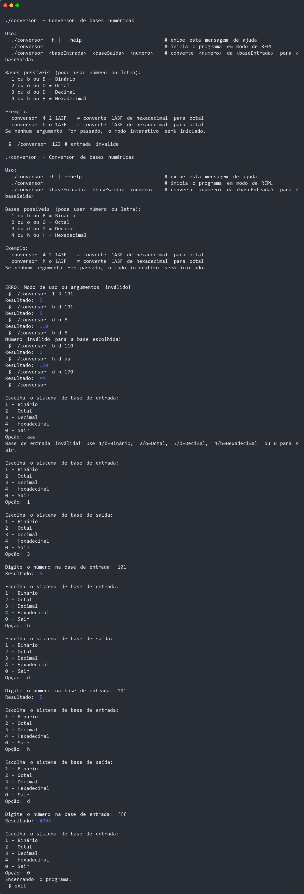

# 🔢 Conversor de Números em C

Um conversor interativo de bases numéricas desenvolvido em linguagem C, capaz de converter números entre :
 - **binário**: representação do sistema númerico de máquinas
 - **octal**: representação de 1 byte
 - **decimal**: sistema padrão humano
 - **hexadecimal**: representação de 2 bytes, ou a maior base númerica múltipla de 8 (octal), menor do que 36 (10 + 26, ou o sistema decimal + o sistema alfabético insensível a maiúsulos e minúsculos)

---

## ✨ Funcionalidades

- Conversão entre quaisquer bases: Binário, Octal, Decimal e Hexadecimal
- Validação automática da entrada conforme a base escolhida
- Interface interativa por menus no terminal (REPL) e comandos por argumentos (CLI)
- Resultado destacado em verde (se o terminal suportar ANSI colors)
- Suporte a UTF-8 para acentuação e caracteres especiais nas mensagens. (locale = pt_br.UTF-8)

---

## 📷 Demonstrações - A


### demo1 - jpg
  

### demo2 - jpg
  

### demo2 - gif
  

### demo3 - jpg
  

### demo3 - gif
  

### demo4 - jpg
  

### demo4 - gif
  

---

## 📷 Demonstrações - B-1

### jpg

#### demo1


#### demo2


#### demo3


#### demo4


### gif

#### demo2


#### demo3


#### demo4


---

## 📷 Demonstrações - B-2

### jpg

- demo1


- demo2


- demo3


- demo4


### gif

- demo2


- demo3


- demo4


---

## 🚀 Como Usar

### 1. Compilação

Certifique-se de ter um compilador C instalado (GCC, MinGW, Clang, etc).

No **Linux/macOS**:

```bash
gcc conversor.c -o conversor
```

No **Windows** (usando MinGW):

```bash
gcc conversor.c -o conversor.exe
```

### 2. Execução

No **Linux/macOS**:

```bash
./conversor
./conversor --help
./conversor <baseDeEntrada> <baseDeSaida> <entrada>
```

No **Windows**:

```bash
conversor.exe
conversor.exe --help
conversor.exe <baseDeEntrada> <baseDeSaida> <entrada>
```

---

## 📋 Exemplo de Uso

### REPL (Read Evaluate Print Loop)

```
Escolha o sistema de base de entrada:

1 - Binário
2 - Octal
3 - Decimal
4 - Hexadecimal
0 - Sair
Opção: 4

Escolha o sistema de base de saída:

1 - Binário
2 - Octal
3 - Decimal
4 - Hexadecimal
0 - Sair
Opção: 1

Digite o número na base de entrada: 1A3F
Resultado: 1101000111111
```
> O resultado será exibido em verde, se o terminal suportar cores ANSI.

### CLI (Command-Line Interface)

```bash
./conversor -h
./conversor --help
./conversor 1 3 101
./conversor b d 101
./conversor d b 6
```

---

## 🧪 Requisitos

- Compilador C (GCC, MinGW, Clang, etc.)
- Terminal com suporte a UTF-8
- (Opcional) Suporte a cores ANSI para destaque do resultado

---

## 🛠️ Estrutura do Projeto

- `demo/*` — arquivos de demonstração
- `conversor` — binário para Linux (ELF x86-64)
- `conversor.exe` — binário para Windows (Portable x86-64)
- `conversor.c` — Código-fonte principal do conversor
- `README.md` — Este arquivo de documentação

---

## 🧠 Aprendizados

Durante o desenvolvimento, a equipe praticou:

- Leitura e validação de strings em C
- Conversão entre diferentes bases numéricas
- Manipulação de arrays e laços
- Uso de `<locale.h>` para suporte a caracteres especiais
- Boas práticas de programação estruturada em C
- Detecção e uso de cores ANSI no terminal

---

## 👥 Equipe (ordem alfabética)

- Adão
- Cairé (https://github.com/cairef)
- Gustavo Sanches
- Jane
- Lucas

---

## 📄 Licença

Este projeto é de uso acadêmico e livre para fins educacionais.

